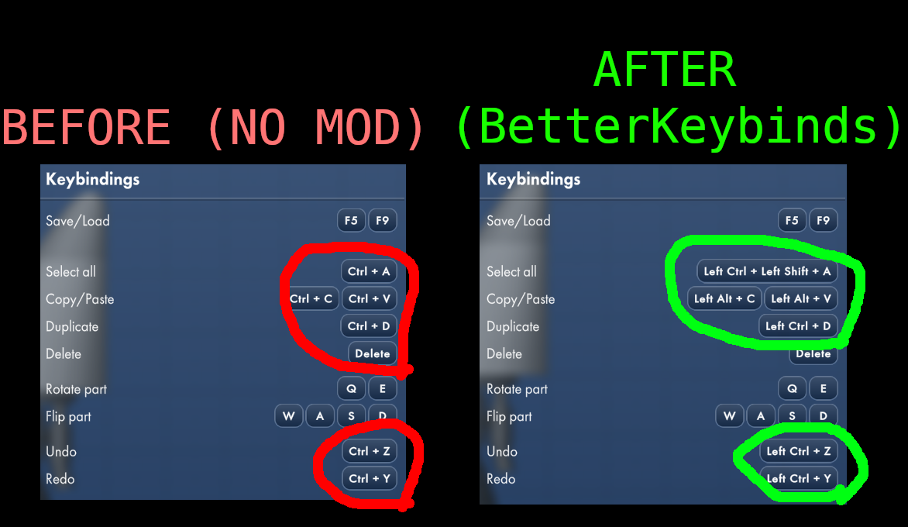

# Better Keybinds

A code mod for the video game Spaceflight Simulator (SFS) that adds the left and right Alt and left and right Shift keys to keybinds.

一个用于《Spaceflight Simulator》（SFS）的代码模组，通过增加更多修饰键来增强游戏的按键绑定功能。

## Requirements and Dependencies
- SFS (PC Version)
  - v1.6.00.16 and newer

## Installation

[Code Mod Installation Guide | SFS Modding Guide](https://kojamori.github.io/SFS-Modding-Guide/getting-started/installation/code-mods)

## Documentation

You can unbind keys by right-clicking on the keybind, which will set their binded key to None.

The current list of accepted modifiers are:
- Left/Right Ctrl
- Left/Right Alt
- Left/Right Shift

In order to add modifiers (e.g. Left Ctrl, Right Ctrl, etc), you have to hold the modifier keys before you click on the keybind option.
This is to support keybinds that are composed of modifier keys only.

For modders, check this guide out to see how to use this in your mods' keybinds!
https://kojamori.github.io/SFS-Modding-Guide/mod-creation/code-mods/better-keybinds

## Social Media

### Forum Post

https://sfsforum.com/index.php?threads/better-keybinds-alt-shift-and-more.20122/

### SFS Modding Guide
https://kojamori.github.io/SFS-Modding-Guide/

### Discord

[Join the discord server here!](https://discord.gg/QHEmcehAe9)

# License

See the [LICENSE](LICENSE) file for details.
